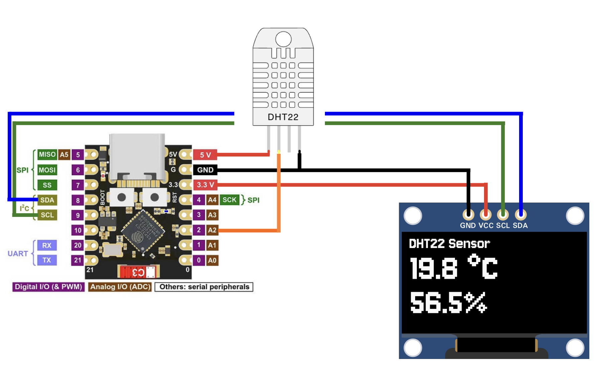

# ESP32-C3 Thermo-Hygrometer (DHT22 + OLED SSD1306)

A minimal temperature and humidity monitor based on **ESP32-C3 Super Mini**, **DHT22 sensor**, and **SSD1306 OLED** (128×64).  
The display shows live temperature (°C) and humidity (%) using large, easy-to-read text.

## Preview

## Features
- Reads temperature & humidity from **DHT22**
- Displays data on **SSD1306 OLED** via I²C
- Clean and simple UI
- Compact hardware wiring with 10kΩ pull-up

## Wiring
- **OLED SDA → GPIO 8**  
- **OLED SCL → GPIO 9**  
- **DHT22 DATA → GPIO 2**  
- **DHT22 VCC → 3.3V**, **GND → GND**  
- **10kΩ resistor** between **DATA** and **VCC**

## Required Libraries
- Adafruit SSD1306  
- Adafruit GFX  
- DHT Sensor Library  
- Adafruit Unified Sensor  